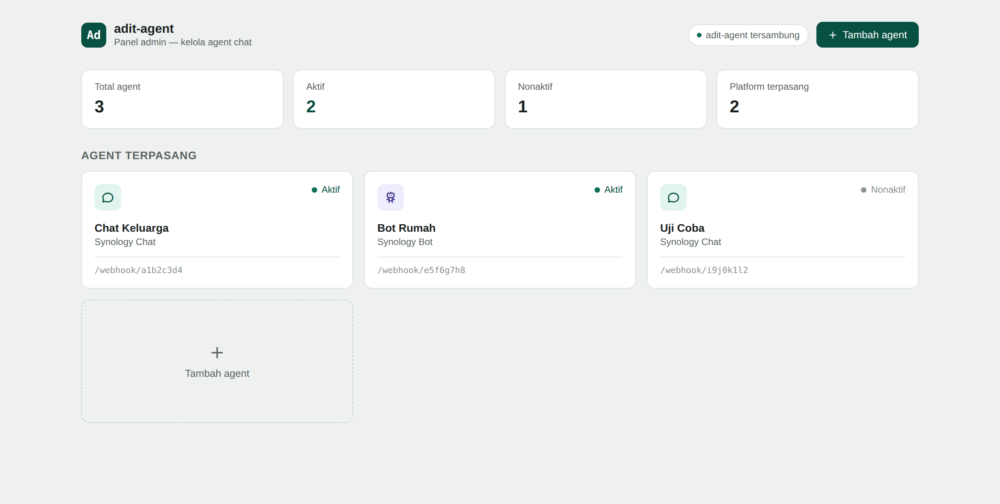

# adit-agent

Penghubung antara aplikasi chat yang kamu pakai sehari-hari (**Synology
Chat** dan **Synology Bot** — **Telegram** segera menyusul) dengan **adit**,
asisten yang menjawab pertanyaan. Cukup pasang sekali, lalu tanya lewat
aplikasi chat yang biasa kamu buka.

Semua pengaturan channel chat — token, URL, aktif/nonaktif — dikelola
lewat satu **panel admin di browser**, tidak perlu edit file konfigurasi
apa pun untuk itu.



*Contoh tampilan panel admin dengan data contoh (bukan data server sungguhan).*

## Jalankan

```bash
cp .env.example .env
# isi ADIT_BASE_URL (alamat server adit) dan ADIT_AGENT_SECRET_KEY (lihat
# petunjuk generate di dalam .env.example) — dua-duanya wajib.

pip install -r requirements.txt
uvicorn app.main:app --host 0.0.0.0 --port 9000
```

Atau dengan Docker Compose:

```bash
docker compose up --build
```

## Tambah channel chat lewat panel admin

Buka **`http://<alamat-server>:9000/admin`** di browser.

1. Klik **"Tambah agent"**, pilih platform (Synology Chat atau Synology
   Bot — Telegram tampil di panel tapi belum bisa disambungkan, lihat
   `TODO.md`).
2. Isi nama agent dan kredensial yang diminta — panel akan menampilkan
   URL webhook yang perlu kamu daftarkan balik di sisi Synology/Telegram.
   Langkah detail per platform ada di:
   - [Synology Chat & Synology Bot](docs/channels/synology-chat.md)
3. Klik **"Tes koneksi"** untuk memastikan pengaturannya benar sebelum
   diaktifkan.
4. Nyalakan toggle **Aktif**, simpan — **langsung aktif menerima pesan
   saat itu juga, tidak perlu restart adit-agent.**

Boleh menambah lebih dari satu agent sekaligus — misalnya Synology Chat
sekaligus Synology Bot dari NAS yang sama — masing-masing berjalan dan
bisa dinyalakan/dimatikan sendiri-sendiri, kapan saja, tanpa saling
ganggu.

## Kalau server ini tidak bisa langsung dijangkau dari internet

Kalau adit-agent jalan di jaringan lokal (mis. NAS di rumah) sementara
Synology Chat cloud atau Telegram perlu menjangkaunya lewat internet,
kamu perlu reverse-proxy/tunnel (Cloudflare Tunnel, Tailscale Funnel, dsb.)
— di luar lingkup repo ini.

## Pengaturan lewat env var

Hanya untuk pengaturan **server**, bukan tempat mengisi kredensial channel
chat (itu semua lewat panel admin di atas):

| Var | Wajib? | Keterangan |
|---|---|---|
| `ADIT_BASE_URL` | ya | Alamat server adit |
| `ADIT_API_KEY` | kalau server adit mensyaratkan | Kunci akses ke server adit |
| `ADIT_AGENT_SECRET_KEY` | **ya** | Kunci enkripsi kredensial yang tersimpan dari panel admin — lihat cara generate di `.env.example` |
| `ADIT_AGENT_ADMIN_TOKEN` | disarankan | Kunci akses ke panel admin (`/admin`) — wajib diisi kalau server ini bisa dijangkau dari luar jaringan lokal terpercaya |
| `ADIT_AGENT_UI_ORIGINS` | tidak | Hanya perlu diisi kalau panel admin dibuka dari alamat/domain yang berbeda dari adit-agent sendiri |
| `ADIT_AGENT_HOST` / `ADIT_AGENT_PORT` | tidak | Alamat & port tempat adit-agent berjalan (default `0.0.0.0:9000`) |

Daftar lengkap (termasuk pengaturan lanjutan seperti panjang jawaban,
timeout) ada di `.env.example` dengan komentar penjelasan masing-masing.

## Untuk pengembang

Penjelasan arsitektur, cara menambah dukungan platform chat baru, dan
catatan keamanan/batasan teknis ada di [`docs/architecture.md`](docs/architecture.md).
Riwayat perubahan tiap versi ada di `CHANGELOG.md`, daftar pekerjaan
terbuka ada di `TODO.md`.
